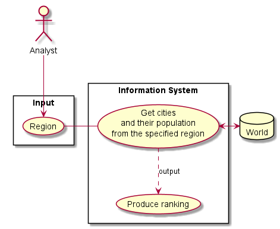

# USE CASE: 3 Produce a Report on Population of All Cities: Worldwide, Continental, Regional, Country-wide or District-wide

## CHARACTERISTIC INFORMATION

### Goal in Context

As an *Analyst* I want to *view all cities worldwide, continental, regional, country-wide or from a specific country district, in descending order based on their population* so that I can *easily inspect population trends*.

### Scope

Company.

### Level

Primary task.

### Preconditions

Region selection.  
Database contains the data.

### Success End Condition

A report is available for the Analyst to analyze.

### Failed End Condition

No report is produced.

### Primary Actor

Company's Analyst.

### Trigger

A request for world information is sent to the Information Department.

## MAIN SUCCESS SCENARIO

1. Population report request for all cities in a given region.
2. Analyst captures region to get the information for.
4. Analyst reports the information.

## SUB-VARIATIONS

None.

## SCHEDULE

**DUE DATE**: Release 1.1

## DIAGRAM

