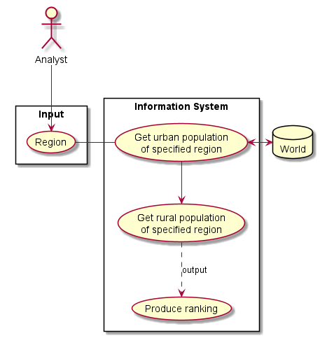

# USE CASE: 7 Produce a Report on Urban and Rural Population: Worldwide, Continental, Regional or Country-wide

## CHARACTERISTIC INFORMATION

### Goal in Context

As an *Analyst* I want to *produce a report that shows total, urban and rural population of a continent, region or country* so I can *justify my hours at work*

### Scope

Company.

### Level

Primary task.

### Preconditions

Region selection.  
Database contains the data.

### Success End Condition

A report is available for the Analyst to inspect.

### Failed End Condition

No report is produced.

### Primary Actor

Company's Analyst.

### Trigger

A request for world information is sent to the Information Department.

## MAIN SUCCESS SCENARIO

1. Countries report request for a given region.
2. Analyst captures region to get the information for.
4. Analyst reports the information.

## SUB-VARIATIONS

None.

## SCHEDULE

**DUE DATE**: Release 1.1

## DIAGRAM

